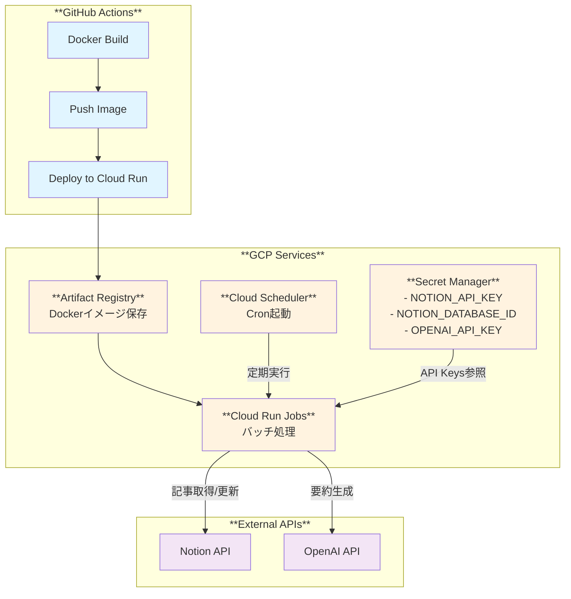
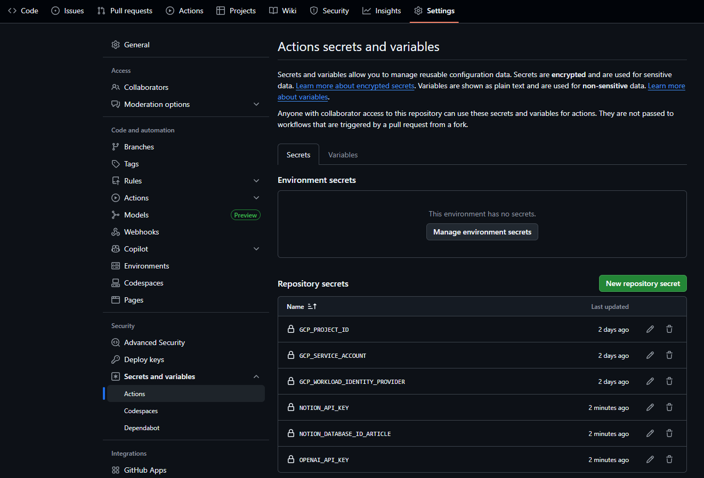

## 概要

### 要件

1. スマホで記事閲覧
2. 共有ボタンから notion の DB に追加
3. python で notion api を叩き、要約や日付、メタデータを付与
4. 3 番を GCP の cloudrun や schedule 実行で自動化

### 開発範囲

1. docker 叩けば実行できる状態を実現済み
   - [github リポジトリ](https://github.com/riririyo-1/docker-notion-automation)
2. gcp で自動実行を実現済み
   現在、GUI から手動でデプロイ中。
3. 今回、terraform 化したい。

---

## 開発環境

### コーディング環境

- **OS:** Ubuntu 22.04
- **Editor:** VS Code
- **Language:** Python 3.12

### LLM 活用・開発フロー

自然言語中心の開発スタイルを採用。

- **Coding:** Claude Code / GitHub Copilot
- **Infra:** Terraform (GCP 状態を CLI で確認しながら宣言的に記述)

### モダン開発プラクティス

運用の手間を極小化し、本質的なロジック（プロンプト調整など）に集中するための構成。

- **CI/CD (GitHub Actions):**
  - `main` ブランチへの Push をトリガーに、Docker ビルド → Artifact Registry への Push → Cloud Run へのデプロイを完全自動化。
  - Terraform の `plan` / `apply` もワークフローに統合（予定）。
  - **OIDC (OpenID Connect):** サービスアカウントキー（JSON）を発行・保存せず、セキュアに GCP 認証を行う。

---

## Tech Stack

- **App:** Python, Docker, Notion API, OpenAI API
- **IaC:** Terraform
- **GCP:**
  - **Compute:** Cloud Run Jobs (バッチ処理として実行)
  - **Trigger:** Cloud Scheduler (Cron 起動)
  - **Security:** Secret Manager (API Key 管理) / IAM (Workload Identity)
  - **Registry:** Artifact Registry
- **CI/CD:** GitHub Actions

---

## Architecture



### アーキテクチャ詳細

- **Cloud Run Jobs**: バッチ処理として記事の要約・メタデータ付与を実行
- **Cloud Scheduler**: 定期実行（Cron）で Cloud Run Jobs をトリガー
- **Artifact Registry**: Docker イメージを保存・管理
- **Secret Manager**: API キーなど機密情報を安全に管理
- **IAM & Workload Identity**: GitHub Actions からの OIDC 認証により、鍵ファイル不要でセキュアにデプロイ

---

## folder structure

```text
gcp-notion-automation/
├── .github/
│   └── workflows/
│       └── deploy.yml       # CI/CD定義 (Build & Deploy)
├── .claude/
├── src/
│   ├── main.py              # アプリケーションのエントリーポイント
│   ├── requirements.txt
│   └── Dockerfile
├── terraform/               # Terraformコード
│   ├── main.tf              # リソース定義 (Cloud Run Jobs, Scheduler等)
│   ├── variables.tf
│   ├── provider.tf
│   └── backend.tf           # State管理 (GCS)
└── README.md
```

---

## GitHub Secrets 管理

Secrets として登録する必要のある項目。

| Secret 名                        | 説明                                                |
| -------------------------------- | --------------------------------------------------- |
| `GCP_PROJECT_ID`                 | GCP プロジェクト ID                                 |
| `GCP_WORKLOAD_IDENTITY_PROVIDER` | Workload Identity Provider の完全な識別子           |
| `GCP_SERVICE_ACCOUNT`            | GitHub Actions 用サービスアカウントのメールアドレス |
| `NOTION_API_KEY`                 | Notion API キー                                     |
| `NOTION_DATABASE_ID`             | Notion Database ID                                  |
| `OPENAI_API_KEY`                 | OpenAI API キー                                     |

下記のように `Settings > Secrets and variables > Actions` から Secrets を登録する。



▲ 登録画面イメージ

---

## Setup & Usage

### 事前準備

- GCP プロジェクトの作成
- GCP プロジェクト 支払いアカウントの設定
- フォルダ構成の作成

#### .env ファイルの作成

プロジェクトルートに `.env` ファイルを作成し、以下の内容を手動で記載する。

```bash
# GCPプロジェクトID
PROJECT_ID=your_gcp_project_id_here

# Notion API設定
NOTION_API_KEY=your_notion_api_key_here
NOTION_DATABASE_ID_ARTICLE=your_notion_database_id_here

# OpenAI API設定
OPENAI_API_KEY=your_openai_api_key_here
```

### Prerequisites

- Terraform CLI のインストール
- gcloud CLI のインストール

```bash
# 0. Homebrewのインストール
/bin/bash -c "$(curl -fsSL https://raw.githubusercontent.com/Homebrew/install/HEAD/install.sh)"

echo >> /home/ryo/.bashrc
echo 'eval "$(/home/linuxbrew/.linuxbrew/bin/brew shellenv)"' >> /home/ryo/.bashrc
eval "$(/home/linuxbrew/.linuxbrew/bin/brew shellenv)"

brew --version

# 1. Install Terraform
brew install hashicorp/tap/terraform

# 2. Install Google Cloud SDK
# Linux の場合
sudo snap install google-cloud-cli --classic
# macOS の場合
brew install --cask google-cloud-sdk

# 3. GitHub CLI（CI/CDの状態確認やSecret設定に便利）
brew install gh
```

### GCP Initial Setup

```bash
# GCPログイン
gcloud auth login
gcloud auth application-default login
# プロジェクトIDを設定
export PROJECT_ID="your-gcp-project-id"
gcloud config set project $PROJECT_ID
# 必要なAPIを有効化
gcloud services enable cloudrun.googleapis.com
gcloud services enable run.googleapis.com
gcloud services enable cloudscheduler.googleapis.com
gcloud services enable secretmanager.googleapis.com
gcloud services enable artifactregistry.googleapis.com
gcloud services enable iamcredentials.googleapis.com
gcloud services enable sts.googleapis.com
```

### Workload Identity (OIDC) の設定

GitHub Actions から GCP へ安全に認証するため、Workload Identity を設定する。

```bash
# 1. Workload Identity Pool の作成
gcloud iam workload-identity-pools create "github-pool" \
  --project="${PROJECT_ID}" \
  --location="global" \
  --display-name="GitHub Actions Pool"

# 2. Workload Identity Provider の作成
# ※ `your-github-username` と `gcp-notion-automation` は適宜置き換え
gcloud iam workload-identity-pools providers create-oidc "github-provider" \
  --project="${PROJECT_ID}" \
  --location="global" \
  --workload-identity-pool="github-pool" \
  --display-name="GitHub Provider" \
  --attribute-mapping="google.subject=assertion.sub,attribute.actor=assertion.actor,attribute.repository=assertion.repository,attribute.repository_owner=assertion.repository_owner" \
  --attribute-condition="assertion.repository_owner == 'your-github-username'" \
  --issuer-uri="https://token.actions.githubusercontent.com"

# 3. GitHub Actions 用のサービスアカウント作成
gcloud iam service-accounts create github-actions-sa \
  --display-name="GitHub Actions Service Account"

# 4. サービスアカウントに必要な権限を付与
gcloud projects add-iam-policy-binding $PROJECT_ID \
  --member="serviceAccount:github-actions-sa@${PROJECT_ID}.iam.gserviceaccount.com" \
  --role="roles/run.admin"

gcloud projects add-iam-policy-binding $PROJECT_ID \
  --member="serviceAccount:github-actions-sa@${PROJECT_ID}.iam.gserviceaccount.com" \
  --role="roles/artifactregistry.writer"

gcloud projects add-iam-policy-binding $PROJECT_ID \
  --member="serviceAccount:github-actions-sa@${PROJECT_ID}.iam.gserviceaccount.com" \
  --role="roles/iam.serviceAccountUser"

# 5. Workload Identity Pool とサービスアカウントをバインド
gcloud iam service-accounts add-iam-policy-binding \
  "github-actions-sa@${PROJECT_ID}.iam.gserviceaccount.com" \
  --project="${PROJECT_ID}" \
  --role="roles/iam.workloadIdentityUser" \
  --member="principalSet://iam.googleapis.com/projects/$(gcloud projects describe $PROJECT_ID --format='value(projectNumber)')/locations/global/workloadIdentityPools/github-pool/attribute.repository/your-github-username/gcp-notion-automation"

# 6. Workload Identity Provider の完全な識別子を取得(GitHub Secretsに登録)
gcloud iam workload-identity-pools providers describe "github-provider" \
  --project="${PROJECT_ID}" \
  --location="global" \
  --workload-identity-pool="github-pool" \
  --format="value(name)"
```

#### GitHub Secrets への登録手順

上記の手順 6 で取得した Workload Identity Provider の識別子を、GitHub Secrets に登録する。

1. GitHub リポジトリのページを開く
2. 上部タブの **[Settings]** をクリック
3. 左メニューの **[Secrets and variables]** → **[Actions]** をクリック
4. **[New repository secret]** ボタンをクリック
5. 以下の 2 つの Secret を登録する

| Secret 名                        | 設定値（例）                                                                                   | 役割                                        |
| -------------------------------- | ---------------------------------------------------------------------------------------------- | ------------------------------------------- |
| `GCP_WORKLOAD_IDENTITY_PROVIDER` | `projects/123.../locations/global/workloadIdentityPools/github-pool/providers/github-provider` | Workload Identity の認証エンドポイント      |
| `GCP_SERVICE_ACCOUNT`            | `github-actions-sa@your-project-id.iam.gserviceaccount.com`                                    | GitHub Actions が使用するサービスアカウント |

**補足:**

- `GCP_WORKLOAD_IDENTITY_PROVIDER`: どこで認証するか（認証の入口）
- `GCP_SERVICE_ACCOUNT`: どの権限を使うか（なりすます対象）

### Terraform Setup

#### 1. Terraform State 管理用の GCS バケット作成

Terraform の状態ファイルを GCS に保存するため、事前にバケットを作成する。

```bash
# プロジェクトIDを設定
export PROJECT_ID="your-gcp-project-id"
export REGION="asia-northeast1"

# State管理用のGCSバケットを作成
gsutil mb -p ${PROJECT_ID} -l ${REGION} gs://${PROJECT_ID}-terraform-state

# バージョニングを有効化(状態の履歴管理)
gsutil versioning set on gs://${PROJECT_ID}-terraform-state
```

#### 2. Terraform ファイルの作成

以下のファイルを `terraform/` ディレクトリに作成する。

**`terraform/provider.tf`**

```hcl
terraform {
  required_version = ">= 1.5.0"

  required_providers {
    google = {
      source  = "hashicorp/google"
      version = "~> 6.0"
    }
  }
}

provider "google" {
  project = var.project_id
  region  = var.region
}
```

**`terraform/backend.tf`**

```hcl
terraform {
  backend "gcs" {
    bucket = "your-project-id-terraform-state"  # 手動で置き換え
    prefix = "terraform/state"
  }
}
```

**`terraform/variables.tf`**

```hcl
variable "project_id" {
  description = "GCP Project ID"
  type        = string
}

variable "region" {
  description = "GCP Region"
  type        = string
  default     = "asia-northeast1"
}

variable "notion_api_key" {
  description = "Notion API Key"
  type        = string
  sensitive   = true
}

variable "notion_database_id" {
  description = "Notion Database ID"
  type        = string
  sensitive   = true
}

variable "openai_api_key" {
  description = "OpenAI API Key"
  type        = string
  sensitive   = true
}

variable "schedule" {
  description = "Cloud Scheduler cron schedule"
  type        = string
  default     = "0 */6 * * *"  # 6時間ごと
}
```

**`terraform/main.tf`**

```hcl
# -- Artifact Registry Repository --------------
resource "google_artifact_registry_repository" "notion_automation" {
  location      = var.region
  repository_id = "notion-automation"
  description   = "Docker repository for Notion automation"
  format        = "DOCKER"
}

# -- Secret Manager: API Keys --------------
resource "google_secret_manager_secret" "notion_api_key" {
  secret_id = "notion-api-key"

  replication {
    auto {}
  }
}

resource "google_secret_manager_secret_version" "notion_api_key" {
  secret      = google_secret_manager_secret.notion_api_key.id
  secret_data = var.notion_api_key
}

resource "google_secret_manager_secret" "notion_database_id" {
  secret_id = "notion-database-id"

  replication {
    auto {}
  }
}

resource "google_secret_manager_secret_version" "notion_database_id" {
  secret      = google_secret_manager_secret.notion_database_id.id
  secret_data = var.notion_database_id
}

resource "google_secret_manager_secret" "openai_api_key" {
  secret_id = "openai-api-key"

  replication {
    auto {}
  }
}

resource "google_secret_manager_secret_version" "openai_api_key" {
  secret      = google_secret_manager_secret.openai_api_key.id
  secret_data = var.openai_api_key
}

# -- Service Account for Cloud Run --------------
resource "google_service_account" "cloudrun_sa" {
  account_id   = "notion-automation-cloudrun"
  display_name = "Service Account for Notion Automation Cloud Run"
}

# Secret Manager へのアクセス権限
resource "google_secret_manager_secret_iam_member" "notion_api_key_access" {
  secret_id = google_secret_manager_secret.notion_api_key.id
  role      = "roles/secretmanager.secretAccessor"
  member    = "serviceAccount:${google_service_account.cloudrun_sa.email}"
}

resource "google_secret_manager_secret_iam_member" "notion_database_id_access" {
  secret_id = google_secret_manager_secret.notion_database_id.id
  role      = "roles/secretmanager.secretAccessor"
  member    = "serviceAccount:${google_service_account.cloudrun_sa.email}"
}

resource "google_secret_manager_secret_iam_member" "openai_api_key_access" {
  secret_id = google_secret_manager_secret.openai_api_key.id
  role      = "roles/secretmanager.secretAccessor"
  member    = "serviceAccount:${google_service_account.cloudrun_sa.email}"
}

# -- Cloud Run Job --------------
resource "google_cloud_run_v2_job" "notion_automation" {
  name     = "notion-automation-job"
  location = var.region

  template {
    template {
      service_account = google_service_account.cloudrun_sa.email

      containers {
        image = "${var.region}-docker.pkg.dev/${var.project_id}/${google_artifact_registry_repository.notion_automation.repository_id}/notion-automation:latest"

        env {
          name = "NOTION_API_KEY"
          value_source {
            secret_key_ref {
              secret  = google_secret_manager_secret.notion_api_key.secret_id
              version = "latest"
            }
          }
        }

        env {
          name = "NOTION_DATABASE_ID_ARTICLE"
          value_source {
            secret_key_ref {
              secret  = google_secret_manager_secret.notion_database_id.secret_id
              version = "latest"
            }
          }
        }

        env {
          name = "OPENAI_API_KEY"
          value_source {
            secret_key_ref {
              secret  = google_secret_manager_secret.openai_api_key.secret_id
              version = "latest"
            }
          }
        }

        resources {
          limits = {
            cpu    = "1"
            memory = "512Mi"
          }
        }
      }

      max_retries = 3
      timeout     = "600s"
    }
  }
}

# -- Cloud Scheduler --------------
resource "google_cloud_scheduler_job" "notion_automation_trigger" {
  name             = "notion-automation-scheduler"
  description      = "Trigger Notion automation job periodically"
  schedule         = var.schedule
  time_zone        = "Asia/Tokyo"
  attempt_deadline = "320s"
  region           = var.region

  http_target {
    http_method = "POST"
    uri         = "https://${var.region}-run.googleapis.com/apis/run.googleapis.com/v1/namespaces/${var.project_id}/jobs/${google_cloud_run_v2_job.notion_automation.name}:run"

    oauth_token {
      service_account_email = google_service_account.cloudrun_sa.email
    }
  }
}

# Cloud Run Job の実行権限をサービスアカウントに付与
resource "google_project_iam_member" "cloudrun_invoker" {
  project = var.project_id
  role    = "roles/run.invoker"
  member  = "serviceAccount:${google_service_account.cloudrun_sa.email}"
}
```

**`terraform/outputs.tf`**

```hcl
output "artifact_registry_repository" {
  description = "Artifact Registry repository URL"
  value       = "${var.region}-docker.pkg.dev/${var.project_id}/${google_artifact_registry_repository.notion_automation.repository_id}"
}

output "cloud_run_job_name" {
  description = "Cloud Run Job name"
  value       = google_cloud_run_v2_job.notion_automation.name
}

output "service_account_email" {
  description = "Service Account email"
  value       = google_service_account.cloudrun_sa.email
}
```

#### 3. 変数ファイルの作成

```bash
cd terraform

# terraform.tfvars を作成
cat <<EOF > terraform.tfvars
project_id          = "your-gcp-project-id"
region              = "asia-northeast1"
notion_api_key      = "secret_xxxxxxxxxxxxx"
notion_database_id  = "xxxxxxxxxxxxxxxxxxxxxxxxxxxxxxxx"
openai_api_key      = "sk-xxxxxxxxxxxxxxxxxxxxxxxxxxxxx"
schedule            = "0 */6 * * *"  # 6時間ごと実行
EOF

# .gitignore に追加(機密情報を含むため)
echo "terraform.tfvars" >> .gitignore
```

#### 4. Terraform 実行

```bash
cd terraform

# 初期化
terraform init

# プラン確認
terraform plan

# デプロイ
terraform apply

# 出力確認
terraform output
```

#### 5. 初回デプロイ後の手動作業

Terraform でインフラを構築した後、初回のみ Docker イメージを手動でプッシュする。

```bash
# Docker イメージをビルド
cd ../src
docker build -t notion-automation .

# Artifact Registry へ認証
gcloud auth configure-docker ${REGION}-docker.pkg.dev

# イメージをタグ付け
docker tag notion-automation:latest \
  ${REGION}-docker.pkg.dev/${PROJECT_ID}/notion-automation/notion-automation:latest

# プッシュ
docker push ${REGION}-docker.pkg.dev/${PROJECT_ID}/notion-automation/notion-automation:latest

# Cloud Run Job を手動で一度実行してテスト
gcloud run jobs execute notion-automation-job --region ${REGION}
```

以降は GitHub Actions で自動的にビルド・デプロイが行われる。

### Local Development

```bash
cd src
# 依存関係をインストール
pip install -r requirements.txt
# 環境変数を設定
export NOTION_API_KEY="your-notion-api-key"
export NOTION_DATABASE_ID="your-notion-database-id"
export OPENAI_API_KEY="your-openai-api-key"
# ローカル実行
python main.py
# Dockerでテスト
docker build -t notion-automation .
docker run -e NOTION_API_KEY="..." -e NOTION_DATABASE_ID="..." -e OPENAI_API_KEY="..." notion-automation
```

---

## CI/CD

GitHub Actions で自動デプロイを実現。

### GitHub Secrets の設定

以下の Secret を GitHub リポジトリに設定：

```bash
# GitHub CLI でログイン
gh auth login

# Secrets を設定
gh secret set GCP_PROJECT_ID -b"your-gcp-project-id"
gh secret set GCP_WORKLOAD_IDENTITY_PROVIDER -b"projects/PROJECT_NUMBER/locations/global/workloadIdentityPools/github-pool/providers/github-provider"
gh secret set GCP_SERVICE_ACCOUNT -b"github-actions-sa@your-gcp-project-id.iam.gserviceaccount.com"
```

**必要な Secrets:**

- `GCP_PROJECT_ID`: GCP プロジェクト ID
- `GCP_WORKLOAD_IDENTITY_PROVIDER`: Workload Identity Provider の完全な識別子
- `GCP_SERVICE_ACCOUNT`: GitHub Actions 用サービスアカウントのメールアドレス

### GitHub Actions ワークフロー

`.github/workflows/deploy.yml` を作成:

```yaml
name: Deploy to Cloud Run

on:
  push:
    branches:
      - main

env:
  PROJECT_ID: ${{ secrets.GCP_PROJECT_ID }}
  REGION: asia-northeast1
  REPOSITORY: notion-automation
  IMAGE_NAME: notion-automation

jobs:
  deploy:
    runs-on: ubuntu-latest
    permissions:
      contents: read
      id-token: write

    steps:
      - name: Checkout code
        uses: actions/checkout@v4

      - name: Authenticate to Google Cloud
        uses: google-github-actions/auth@v2
        with:
          workload_identity_provider: ${{ secrets.GCP_WORKLOAD_IDENTITY_PROVIDER }}
          service_account: ${{ secrets.GCP_SERVICE_ACCOUNT }}

      - name: Set up Cloud SDK
        uses: google-github-actions/setup-gcloud@v2

      - name: Configure Docker for Artifact Registry
        run: |
          gcloud auth configure-docker ${{ env.REGION }}-docker.pkg.dev

      - name: Build Docker image
        run: |
          docker build -t ${{ env.REGION }}-docker.pkg.dev/${{ env.PROJECT_ID }}/${{ env.REPOSITORY }}/${{ env.IMAGE_NAME }}:${{ github.sha }} \
                       -t ${{ env.REGION }}-docker.pkg.dev/${{ env.PROJECT_ID }}/${{ env.REPOSITORY }}/${{ env.IMAGE_NAME }}:latest \
                       ./src

      - name: Push Docker image to Artifact Registry
        run: |
          docker push ${{ env.REGION }}-docker.pkg.dev/${{ env.PROJECT_ID }}/${{ env.REPOSITORY }}/${{ env.IMAGE_NAME }}:${{ github.sha }}
          docker push ${{ env.REGION }}-docker.pkg.dev/${{ env.PROJECT_ID }}/${{ env.REPOSITORY }}/${{ env.IMAGE_NAME }}:latest

      - name: Deploy to Cloud Run Job
        run: |
          gcloud run jobs update notion-automation-job \
            --image=${{ env.REGION }}-docker.pkg.dev/${{ env.PROJECT_ID }}/${{ env.REPOSITORY }}/${{ env.IMAGE_NAME }}:latest \
            --region=${{ env.REGION }}
```

### デプロイフロー

#### アプリケーションデプロイ (`deploy.yml`)

1. `main`ブランチに Push (src/ 配下の変更)
2. GitHub Actions が Docker イメージをビルド
3. Artifact Registry にプッシュ
4. Cloud Run Jobs を更新
5. Cloud Scheduler が定期実行

#### インフラ変更 (`terraform.yml`)

1. `terraform/` 配下のファイルを変更
2. PR 作成時に `terraform plan` が自動実行
3. PR にプラン内容がコメントされる
4. `main` にマージすると `terraform apply` が自動実行
5. GCP インフラが更新される

---

## Terraform CI/CD のセットアップ

### 1. GCP 権限設定

既存のサービスアカウントに Terraform 実行権限を付与する。

```bash
# プロジェクトIDを設定
export PROJECT_ID="your-gcp-project-id"

# サービスアカウントのメールアドレス
SA_EMAIL="github-actions-sa@${PROJECT_ID}.iam.gserviceaccount.com"

# Cloud Scheduler 管理権限
gcloud projects add-iam-policy-binding $PROJECT_ID \
  --member="serviceAccount:${SA_EMAIL}" \
  --role="roles/cloudscheduler.admin"

# Secret Manager 管理権限
gcloud projects add-iam-policy-binding $PROJECT_ID \
  --member="serviceAccount:${SA_EMAIL}" \
  --role="roles/secretmanager.admin"

# Service Account 管理権限
gcloud projects add-iam-policy-binding $PROJECT_ID \
  --member="serviceAccount:${SA_EMAIL}" \
  --role="roles/iam.serviceAccountAdmin"

# IAM Policy 管理権限
gcloud projects add-iam-policy-binding $PROJECT_ID \
  --member="serviceAccount:${SA_EMAIL}" \
  --role="roles/resourcemanager.projectIamAdmin"

# Storage 管理権限 (Terraform State用)
gcloud projects add-iam-policy-binding $PROJECT_ID \
  --member="serviceAccount:${SA_EMAIL}" \
  --role="roles/storage.admin"
```

### 2. GitHub Secrets の追加設定

Terraform 用に以下の Secrets を追加する。

```bash
# GitHub CLI でログイン
gh auth login

# Terraform 用 Secrets を設定
gh secret set NOTION_API_KEY -b `your_notion_api_key_here`
gh secret set NOTION_DATABASE_ID -b `your_notion_database_id_here`
gh secret set OPENAI_API_KEY -b `your_openai_api_key_here`

# 設定確認
gh secret list
```

### 3. 動作確認

```bash
# terraform/ 配下のファイルを変更
cd terraform
# 例: スケジュールを変更
vim variables.tf

# Git にコミット & プッシュ
git add .
git commit -m "Update Cloud Scheduler schedule"
git push origin main

# GitHub Actions で自動的に terraform apply が実行される
```

---

## リソース削除

プロジェクトを削除する場合:

```bash
# Terraform で管理しているリソースを削除
cd terraform
terraform destroy

# Workload Identity 関連リソースの削除
gcloud iam service-accounts delete github-actions-sa@${PROJECT_ID}.iam.gserviceaccount.com --quiet

gcloud iam workload-identity-pools delete github-pool \
  --location=global \
  --quiet

# State管理用バケットの削除
gsutil -m rm -r gs://${PROJECT_ID}-terraform-state
```

---

## 設定管理ガイド

### 各設定項目の配置場所

| **設定項目**                     | **配置場所**       | **用途**           | **必須レベル** |
| -------------------------------- | ------------------ | ------------------ | -------------- |
| **非機密情報**                   |                    |                    |                |
| `PROJECT_ID`                     | terraform.tfvars   | Terraform デプロイ | ✅             |
| `GCP_PROJECT_ID`                 | GitHub Secrets     | CI/CD              | ✅             |
| **機密情報（API Keys）**         |                    |                    |                |
| `NOTION_API_KEY`                 | GCP Secret Manager | Cloud Run 実行時   | ✅             |
| `NOTION_DATABASE_ID_ARTICLE`     | GCP Secret Manager | Cloud Run 実行時   | ✅             |
| `OPENAI_API_KEY`                 | GCP Secret Manager | Cloud Run 実行時   | ✅             |
| **CI/CD 認証情報**               |                    |                    |                |
| `GCP_WORKLOAD_IDENTITY_PROVIDER` | GitHub Secrets     | CI/CD 認証         | ✅             |
| `GCP_SERVICE_ACCOUNT`            | GitHub Secrets     | CI/CD 認証         | ✅             |

---
